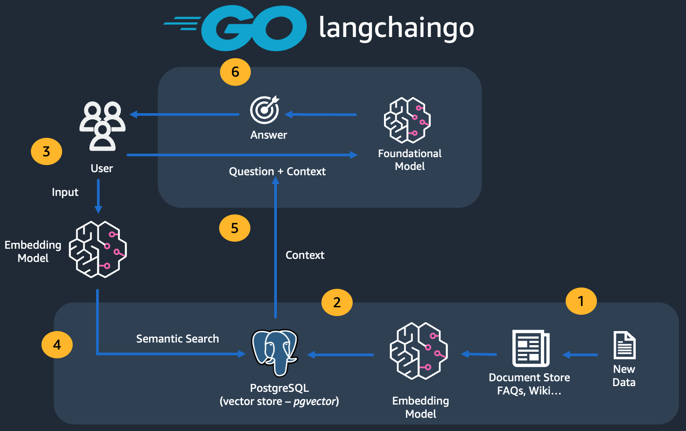

# How to use Retrieval Augmented Generation (RAG) for Go applications

> Implement RAG (using LangChain and PostgreSQL) to improve the accuracy and relevance of LLM outputs

This repository contains source code corresponding to the blog post [How to use Retrieval Augmented Generation (RAG) for Go applications](https://community.aws/content/2f1mRXuakNO22izRKDVNRazzxhb) which covers how to leverage the [Go programming language](https://go.dev/) to use Vector Databases and techniques such as Retrieval Augmented Generation (RAG) with [langchaingo](https://github.com/tmc/langchaingo). 



Large Language Models (LLMs) and other foundation models have been trained on a large corpus of data enabling them to perform well at many natural language processing (NLP) tasks. But one of the most important limitations is that most foundation models and LLMs use a static dataset which often has a specific knowledge cut-off (say, January 2023). 

RAG (Retrieval Augmented Generation) enhances LLMs by dynamically retrieving external information during the response generation process, thereby expanding the model's knowledge base beyond its original training data. RAG-based solutions incorporate a vector store which can be indexed and queried to retrieve the most recent and relevant information, thereby extending the LLM's knowledge beyond its training cut-off. When an LLM equipped with RAG needs to generate a response, it first queries a vector store to find relevant, up-to-date information related to the query. This process ensures that the model's outputs are not just based on its pre-existing knowledge but are augmented with the latest information, thereby improving the accuracy and relevance of its responses.


## License

See the LICENSE file.


### Install

1. Install [ollama](https://ollama.com/download)

2. Serve llama3

```bash
ollama pull llama3
ollama serve
curl --location --request GET 'http://localhost:11434/'
```

3. Start PostgreSQL with the vector extension

```bash
``` bash
docker run --name pgvector --rm -dit -p 5432:5432 -e POSTGRES_USER=postgres -e POSTGRES_PASSWORD=postgres ankane/pgvector
env PGPASSWORD=postgres psql -h localhost -U postgres -c 'CREATE EXTENSION IF NOT EXISTS vector;';
```

4. Start the app

```bash
export PG_HOST=localhost
export PG_USER=postgres
export PG_PASSWORD=postgres
export PG_DB=postgres
go clean;go build -o app;chmod +x app;./app
```

6. Open the browser and navigate to `http://localhost:8080/` to access the UI.


## Using the REST API server

To interact with the REST API server you've set up for the functions `load`, `rag_search`, and `semantic_search`, 
you can use the following `curl` commands:


### API Documentation

This document outlines the usage of the REST API for loading documents, performing RAG search, and conducting 
semantic search.

##### Load Documents

This endpoint allows for the uploading of documents to be processed and stored.

- **URL**: `/load`
- **Method**: `POST`
- **Content-Type**: `application/json`
- **Body**:
  ```json
  {
    "source": "URL_OF_THE_SOURCE"
  }

cURL Example:<pre>curl  --request POST --location 'http://localhost:8080/load'  --header 'Content-Type: application/json' --data '{ "source": "https://docs.aws.amazon.com/AmazonS3/latest/userguide/Welcome.html#CoreConcepts" }' </pre>

##### RAG Search
This endpoint performs a Retrieval Augmented Generation (RAG) search to provide answers based on the query provided.  
URL: /rag_search
Method: POST
Content-Type: application/json
Body:<pre>{ "query": "YOUR_QUERY", "maxResults": MAX_RESULTS } </pre>
cURL Example:<pre>curl  --request POST --location 'http://localhost:8080/rag_search'  --header 'Content-Type: application/json'  --data-raw '{ "query": "what is amazon s3?", "maxResults": 10 }' </pre>

##### Semantic Search
This endpoint performs a semantic search to find documents that are semantically similar to the query provided.

URL: /semantic_search
Method: POST
Content-Type: application/json
Body:<pre>{ "query": "YOUR_QUERY", "maxResults": MAX_RESULTS } </pre>
cURL Example:<pre>curl  --request POST --location 'http://localhost:8080/semantic_search'  --header 'Content-Type: application/json'  --data-raw '{ "query": "s3", "maxResults": 5 }' </pre>


